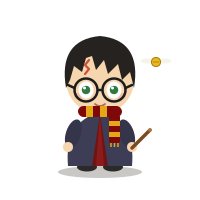
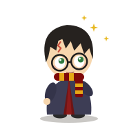
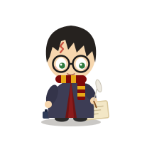
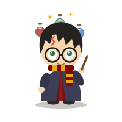
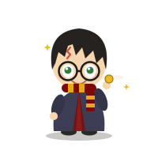
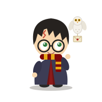

# Harry Potter — Clawd on Desk Theme

A chibi Harry Potter desk pet theme for [Clawd on Desk](https://github.com/rullerzhou-afk/clawd-on-desk): messy hair, round glasses, lightning scar, Gryffindor scarf — and a golden snitch that never leaves him alone.

All assets are pure CSS-animated SVG, no GIFs or external dependencies.

## Preview

<p align="center">
  
</p>

<table>
  <tr>
    <td align="center"><br><sub>Idle</sub></td>
    <td align="center"><br><sub>Thinking</sub></td>
    <td align="center"><br><sub>Working</sub></td>
    <td align="center"><br><sub>Juggling</sub></td>
  </tr>
  <tr>
    <td align="center"><br><sub>Attention</sub></td>
    <td align="center"><br><sub>Notification</sub></td>
    <td align="center"><br><sub>Sleeping</sub></td>
    <td align="center"><br><sub>Error</sub></td>
  </tr>
</table>

## States

| State | Behavior |
|-------|----------|
| idle | Eye tracking, breathing, scarf sway, golden snitch buzzing around |
| thinking | Head tilt, gold sparkles of a spell forming |
| working (1 session) | Writing with a quill on parchment |
| juggling (2 sessions) | Wingardium Leviosa — levitating three potion bottles |
| building (3+ sessions) | Shelving a stack of spellbooks |
| sleep sequence | Yawn → doze → collapse → sleep (glasses folded on the floor) → wake |
| error | Spell backfire — smoke, sparks, soot on cheek |
| attention | Caught the snitch! |
| notification | Hedwig delivers a wax-sealed letter |
| sweeping | Sweeping up with the Nimbus 2000 |
| carrying | Hauling a stack of library books |

## Reactions

- **drag** — flailing, scarf flying
- **click / double-click** — Lumos! wand sparks
- **poking repeatedly** — annoyed, arms crossed

## Install with Claude Code (copy-paste prompt)

Paste this into [Claude Code](https://claude.com/claude-code) (or any coding agent) and it will install the theme for you:

```text
Install the Clawd on Desk theme from https://github.com/rahulrajsbkk/clawd-harry-potter-theme
Clone the repo and copy theme.json and the assets/ folder into my Clawd on Desk
user themes directory as "harry-potter":
  - macOS:   ~/Library/Application Support/clawd-on-desk/themes/harry-potter
  - Windows: %APPDATA%\clawd-on-desk\themes\harry-potter
  - Linux:   ~/.config/clawd-on-desk/themes/harry-potter
Don't touch the app's built-in themes. When done, remind me to restart
Clawd on Desk and select "Harry Potter" under Settings → Theme.
```

## Install manually

1. Copy this folder to your Clawd themes directory:
   - **macOS**: `~/Library/Application Support/clawd-on-desk/themes/harry-potter/`
   - **Windows**: `%APPDATA%\clawd-on-desk\themes\harry-potter\`
   - **Linux**: `~/.config/clawd-on-desk/themes/harry-potter/`
2. Restart Clawd on Desk, then Settings → Theme → **Harry Potter**.

## Credits

Unofficial fan-made theme. Harry Potter belongs to its respective rights holders. Built on the [Clawd on Desk](https://github.com/rullerzhou-afk/clawd-on-desk) theme system, referencing the Clawd Plana, Octo Agent, and Poodle Claude themes.
